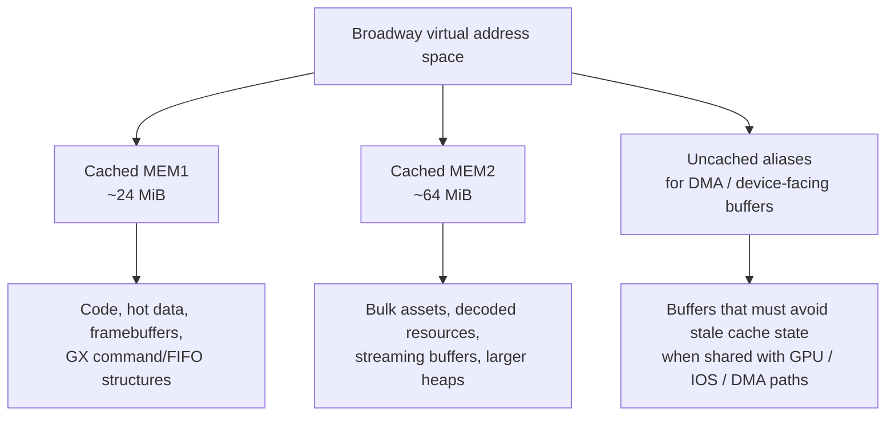
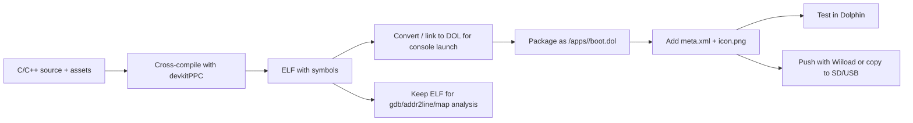

# Comprehensive Technical Design Report for Lawful Nintendo Wii Homebrew Development

## Executive summary

For experienced C/C++ developers, the original Wii remains a highly approachable embedded target: a single-core PowerPC CPU (“Broadway”), a fixed-function ATI-designed GPU (“Hollywood”), 24 MiB of low-latency 1T-SRAM plus 64 MiB of GDDR3, 512 MiB of internal NAND, SD storage, USB 2.0, Bluetooth controllers, and integrated 802.11b/g networking. Publicly documented development still centres on urldevkitProhttps://devkitpro.org, urlWiiBrewhttps://wiibrew.org, the official legacy manuals from urlNintendo UK supportturn29search1 and the urlWii operations manualsturn30search0, plus testing in urlDolphin Emulatorhttps://dolphin-emu.org. citeturn2view2turn33view0turn41view0turn42view2turn21view2

The central compliance finding is not technical but legal. The compiler/toolchain side distributed by devkitPro is openly developed and package-managed, and that part is straightforward to justify for lawful research. The problem is `libogc`, the de facto Wii/GameCube platform library used by most existing homebrew stacks, which is under unresolved copyright/provenance dispute: the archived urlfail0verflow HBC repositoryturn10search9 alleges copying from Nintendo SDK code and from entity["organization","RTEMS","embedded rtos project"]; RTEMS publicly reserved its rights; and a current contributor disputed at least part of the RTEMS characterisation without fully eliminating the risk. A conservative institutional or commercial policy should therefore treat `libogc` and every higher-level Wii library built atop it as **legally contested**, not as a clean-room “safe” SDK. citeturn11view0turn12search1turn11view2

That changes the recommendation matrix. If your priority is practical homebrew experimentation on owned hardware, the community stack is still the most complete. If your priority is **strict lawful/academic cleanliness**, the safest posture is narrower: use the open compiler/toolchain, rely on public documentation, prototype primarily in Dolphin or on privately owned hardware, avoid distributing anything that depends on contested provenance unless your institution has completed an independent audit, and avoid any workflow that touches Nintendo proprietary SDK material, leaked headers, retail assets, keys, tickets, WADs, or circumvention payloads. citeturn15search2turn15search6turn11view0turn28search13

## Platform baseline

### Hardware profile

| Area | Publicly documented baseline | Evidence |
|---|---|---|
| CPU | “Broadway” PowerPC CPU, 729 MHz, 32 KiB I-cache, 32 KiB D-cache, 256 KiB L2, paired-single FP support, write-gather buffer for graphics command lists | citeturn33view0turn32search3 |
| GPU | “Hollywood” at 243 MHz, derived from the GameCube/Flipper family, fixed-function pipeline exposed through GX/TEV rather than a modern shader ISA | citeturn2view2turn25search3turn36view1 |
| Main memory | 24 MiB 1T-SRAM (“MEM1”) + 64 MiB GDDR3 (“MEM2”) | citeturn2view2turn36view1 |
| Internal storage | 512 MiB NAND flash | citeturn2view2 |
| External storage / ports | Front SD slot, two USB 2.0 ports; original RVL-001 also exposes GameCube controller and memory card slots | citeturn2view2turn30search0 |
| Networking | Integrated 802.11b/g Wi-Fi; USB LAN adapter support documented by Nintendo; official Nintendo Wi-Fi Connection game services ended in 2014 | citeturn2view2turn30search1turn29search1turn29search3 |
| Input | Wii Remote over Bluetooth, Nunchuk / Classic Controller extensions, sensor-bar pointing, Balance Board and some USB keyboards | citeturn28search19turn28search8turn30search0turn30search1 |
| Audio hardware | Public hardware summaries list an auxiliary DSP at 121.5 MHz; common homebrew audio mixing is typically performed through ASND/AESND abstractions at 48 kHz | citeturn2view2turn31search0 |

The original retail Wii assumption is the right one for development notes. It preserves GameCube ports, SD support, and the standard 4.3 retail firmware path. The later Wii mini is materially different: WiiBrew documents its “4.3-Mini” menu as having Internet and SD settings removed because the hardware lacks them, so it is not a good baseline for general-purpose homebrew documentation. citeturn41view0

### Firmware and OS baseline

WiiBrew’s system-menu history shows the retail firmware lineage from 1.0 to 4.3, with **4.3** the last retail System Menu on 21 June 2010, using IOS80 variants. Separate from the user-facing System Menu, IOS is the ARM-side operating system that provides the microkernel, device model, NAND filesystem, IPC and services such as sockets, USB, SDI and WLAN. IOS58 is especially relevant for homebrew because WiiBrew documents it as containing the EHCI USB 2.0 backend and the later USB stack modules used by HID, vendor and mass-storage front ends. citeturn41view0turn42view0turn42view2

From a document-design perspective, the most useful firmware guidance is therefore simple:

1. Assume **retail System Menu 4.3** on original NTSC/PAL hardware unless the reader explicitly targets a different environment.
2. Describe gameplay/application code as running on **Broadway**, with I/O and OS services mediated through **IOS** on **Starlet**.
3. Call out **IOS58** whenever USB 2.0 throughput, HID, or mass-storage concerns matter. citeturn33view0turn42view0turn42view2

### Simplified public memory model

WiiBrew’s published hardware and memory-map material supports the usual two-pool programming model used by Wii developers: small, latency-sensitive MEM1 and larger bulk-storage MEM2. A practical design rule is to keep framebuffers, hot render state, command buffers and frequently touched structures in MEM1 where possible, while pushing bulk assets, decoded content, caches and streaming buffers into MEM2. The paired-single unit and write-gather path make the CPU particularly happy with well-batched math and graphics submission. citeturn2view2turn33view0turn2view3



In prose, the memory layout section of a technical document should explicitly distinguish **capacity**, **latency**, and **coherency responsibilities**. That matters more on Wii than on desktop-style platforms because 88 MiB total sounds generous until texture uploads, framebuffers, audio buffers, runtime heaps and decoded assets begin to compete. The Clover “Toy Box on Wii” port is a good modern reminder of this: it reports running into practical memory-pressure issues and explicitly calls out the Wii’s split 88 MiB arrangement. citeturn36view1turn2view2

## Software environment and filesystem

### Publicly documented filesystem and common paths

WiiBrew describes the NAND flash layout in a way that is extremely useful for lawful development and academic explanation because it stays at the filesystem/service boundary rather than drifting into piracy workflows. The core NAND roots of interest are `/title`, `/ticket`, `/shared1`, `/shared2`, `/tmp`, `/import`, `/meta` and `/sys`; WiiBrew also documents `/shared2/sys/SYSCONF` for general settings, `/shared2/sys/net` for network profiles, `/shared2/menu` for public menu state, and `/shared2/sys/NANDBOOTINFO` for last-launched title state. The filesystem is exposed through `/dev/fs`, and WiiBrew lists standard FS ioctls such as create, delete, rename, directory listing and usage/stat operations. citeturn27view0turn27view1

| Path / device | What it is for | Notes for a lawful document |
|---|---|---|
| `/dev/fs` | IOS filesystem service endpoint | Use for explaining FS RPC shape and virtual-device model, not for destructive examples. citeturn27view1 |
| `/title` | Installed-title contents | Useful for architecture diagrams; avoid telling readers to modify retail content. citeturn27view0 |
| `/ticket` | Installed-title tickets | Mention only as part of OS design, not deployment. citeturn27view0 |
| `/shared1` | Shared installed contents | System-managed shared storage. citeturn27view0 |
| `/shared2/sys/SYSCONF` | General system settings | Good example of system-state storage. citeturn27view0 |
| `/shared2/sys/net` | Network profiles | Relevant when documenting Wi-Fi configuration interactions. citeturn27view0 |
| `/tmp` | Temporary area | Cleaned when IOS boots; safe example for scratch-file discussion. citeturn27view0turn27view1 |
| `/wfs` | Appears in 4.3 | WiiBrew lists it under `/dev/fs` for 4.3-only environments. citeturn27view1 |

For homebrew packaging, the relevant filesystem is normally **FAT on SD or USB**, not NAND. The Homebrew Channel help page states that applications are expected as `boot.dol` or `boot.elf`, with `icon.png` and `meta.xml`, inside an `apps` folder. The same page explains the conventional layout `SD:/apps/<appname>/boot.dol`, and WiiBrew’s Homebrew Browser notes also expect an `icon.png`, commonly 128×48, and a `meta.xml`. citeturn27view2turn26search15

### Homebrew-safe deployment paths

WiiBrew’s Homebrew Channel page and Wiiload page document the two mainstream lawful deployment paths for self-authored homebrew: load from SD/SDHC via the Homebrew Channel, or push a `.dol`/`.elf` over the network using Wiiload. Dolphin provides a third path for development-only testing: WiiBrew’s debugging page notes that you can simply use Dolphin’s **Open** action on a `.dol` or `.elf` without installing the Homebrew Channel at all. citeturn26search0turn27view3turn21view2

The resulting documentation recommendation is straightforward: make the **distribution target** the Homebrew Channel app directory, make the **development fast path** Wiiload, and make **Dolphin** the default first-pass testing environment. Do not normalise WAD packaging or any workflow centred on retail-title replacement in a lawful-use document. citeturn27view2turn27view3turn21view2turn28search13

## Rendering, audio, and I/O

### Graphics pipeline and rendering model

The Wii homebrew graphics story is still a GX story. Public community documentation and modern ports agree on the central point: GX is closest in spirit to **fixed-function OpenGL**, not to programmable modern APIs, and the fragment side is driven by the TEV pipeline rather than general-purpose shaders. The TEVSL project describes Flipper/Hollywood as having a fixed-function fragment-processing pipeline that can be made to look shader-like but is not fully programmable. The Clover “Toy Box on Wii” port also describes GX as “very similar to fixed-function OpenGL”, and modern OpenGX work shows that OpenGL 2-era software can be mapped onto GX by translating higher-level draw state into the minimum required GX commands. citeturn25search3turn36view1turn36view0

That yields a precise API statement for a technical document:

- **Native public homebrew API:** GX.
- **Friendly lightweight wrapper:** GRRLIB, which presents a friendlier interface to GX.
- **Portability wrappers / translation layers:** SDL2 on Wii, `gl2gx`, and more experimental OpenGX-style approaches.
- **Not native on Wii:** Direct3D, Vulkan, Metal, OpenGL ES in the mobile sense, or desktop OpenGL as a hardware API. When such abstractions exist, they are translation layers on top of GX. citeturn38search6turn36view4turn36view0

In performance terms, public modern examples are sparse but informative. Alberto Mardegan’s OpenGX port of *chro.mono* reports 60 FPS despite complex shader-like effects mapped into GX, while Clover’s Wii port of Toy Box reports 60 FPS in some scenes but falling to 20 FPS when rendering an entire larger map, strongly suggesting that culling, overdraw control, and scene complexity dominate “engine choice” once the renderer is on real hardware. Community discussion around the newer SDL2 Wii port also indicates better performance than SDL1 in at least some workloads. citeturn36view0turn36view1turn36view3

### Texture, asset and compression strategy

The most useful asset guidance for Wii is to separate **authoring format** from **runtime format**. Public porting notes show that Wii/GameCube texture formats can be awkward: Clover’s Toy Box write-up specifically notes that GX RGBA8 uses a tiled 4×4 block arrangement, and that RGB565 behaves more like developers expect. That is a strong practical hint to keep source art in standard interchange formats, then convert at build time into runtime-friendly representations, instead of trying to edit hardware-native blobs by hand. citeturn36view1

A conservative, lawful, low-friction recommendation is therefore:

- **Still images / UI source assets:** PNG, because `libpng` is the official PNG reference library and is widely available in open toolchains. citeturn39search0turn39search4
- **Runtime textures:** preconvert during the build to hardware-friendly GX layouts; prefer packed/opaque formats for backgrounds and reserve expensive full-alpha layouts for assets that genuinely require them. The public evidence for RGBA8’s awkward layout makes this a practical, not theoretical, recommendation. citeturn36view1turn43search0
- **Audio assets:** Ogg Vorbis for music/long-form audio, because Xiph documents libvorbis and Tremor as BSD-licensed/free implementations, and ASND is commonly used for 48 kHz mixing on Wii. citeturn40search1turn40search5turn31search0
- **Packfiles / data blobs:** deflate/zlib-class compression for general archives; the zlib codebase remains a standard permissive option. citeturn38search5turn39search16
- **Fonts:** FreeType is suitable when your project needs serious text rendering; its most common licence choice is the FreeType Licence, a BSD-style licence with a credit clause. citeturn40search0

### Controllers, sensors, networking and audio I/O

WiiBrew documents the Wii Remote as a Bluetooth device with an expansion port; Nintendo’s manuals document the use of Wii Remote Plus, Classic Controller / Classic Controller Pro and USB keyboards in at least some software contexts. Extension-controller documentation on WiiBrew also confirms the practical importance of Nunchuk and Classic Controller support for homebrew. The key architectural detail for documentation is that “sensor bar” input is really **IR-pointing support in the Wii Remote ecosystem**, layered on top of Bluetooth transport and extension-controller state. citeturn28search19turn28search8turn30search0turn30search1

For networking, IOS exposes sockets (`/dev/net/ip/*`), high-level WLAN (`/dev/net/wd/*`) and low-level WLAN (`/dev/wl0`) services. Nintendo’s official Wi-Fi Connection service shutdown matters only for historical online game services; it does **not** mean the hardware network stack is unusable for your own homebrew protocols, LAN tools, debugging or HTTP clients. A technical document should spell that distinction out clearly so readers do not confuse “Nintendo’s servers are gone” with “the console cannot network”. citeturn42view0turn29search0turn29search1turn29search3

For audio, WiiBrew’s ASndlib page is still the clearest practical baseline: 48 kHz internal mixing, up to 16 voices, mono or stereo, 8- or 16-bit signed samples, and support paths for MOD/OGG integrations. In a modern design document, that makes a strong default recommendation: use short PCM-ish sfx for latency-sensitive sounds, use Vorbis/Tremor-class compressed music for streamed or decoded background audio, and keep the audibility/memory trade-off explicit. citeturn31search0

## Toolchains, SDKs and engine options

### Toolchain and library comparison

The public Wii stack now needs to be evaluated on **two axes**: technical maturity and legal cleanliness. Those axes are no longer aligned.

| Component | Stated licence / status | Technical value | Compliance recommendation |
|---|---|---|---|
| devkitPPC via urldevkitProhttps://devkitpro.org | Open-source GCC/newlib-based cross toolchain; built/distributed through devkitPro packaging; GCC runtime libraries benefit from the GCC Runtime Library Exception | Mature compiler/binutils base; current devkitPro distribution recommends pacman packages and also publishes source buildscripts | **Recommended base toolchain** for lawful research and clean-room work, subject to normal OSS licence review. citeturn15search2turn15search6turn31search8turn39search3turn39search6turn39search12 |
| `libfat` | BSD-style permissive header terms in the upstream source | FAT12/16/32 access for SD/USB media | **Recommended** where independently sufficient; low direct legal risk. citeturn26search10turn26search18 |
| `SDL2` | zlib licence | Portable app/game layer; current Wii port exists and community reports it as faster than SDL1 in some cases | **Conditionally useful**, but on Wii it still rides a platform backend, so it inherits the platform-library risk underneath. citeturn40search2turn9search2turn36view3 |
| `GRRLIB` | MIT licence | Friendly 2D/3D wrapper around GX, still maintained by the community | **Technically attractive for 2D/UI**, but legally inherits the same platform-stack concern as the underlying Wii library layer. citeturn38search0turn38search6turn38search8 |
| `gl2gx` | LGPL | OpenGL-style wrapper for GX; useful for legacy ports | **Niche only**: development is on hold and predictability is lower than direct GX. citeturn36view4 |
| `libogc` | Public repository exists, but effective provenance/licensing status is **contested** | The dominant Wii/GameCube platform library; still receives releases; recent releases add Tuxedo-based threading support | **Do not classify as low-risk or clean-room** until independently resolved. citeturn15search1turn13search2turn11view0turn12search1turn11view2 |

Supporting libraries for a lawful asset stack are much easier to justify. `libpng` uses the PNG reference-library licence, FreeType is dual-licensed with the FreeType Licence the common permissive choice, Vorbis and Tremor are BSD/BSD-like in the Xiph ecosystem, `libjpeg-turbo` uses a BSD-style licence, and SDL2 uses zlib. These are the kinds of dependencies a university or research lab can usually clear with standard open-source review. citeturn39search0turn39search1turn40search0turn40search1turn40search5turn40search2turn38search5

### Engine and renderer comparison

| Option | Best fit | Public performance evidence | Trade-offs |
|---|---|---|---|
| Raw GX / handwritten renderer | Hardware-focused apps, 3D, fixed budgets, teaching the real pipeline | Modern OpenGX-on-GX work reports 60 FPS on *chro.mono*; public ports show that careful scene complexity management matters more than abstraction ideology | Highest effort, best control, easiest place to document TEV/fixed-function reality honestly. citeturn36view0turn25search3 |
| `GRRLIB` | 2D games, tools, launchers, UI-heavy homebrew | No serious official benchmark suite published; it is a friendly GX wrapper rather than a radically different renderer | Lowest onboarding cost for C projects; reduced control over lower-level batching/state. citeturn38search6turn34search19 |
| `SDL2` Wii port | Portable 2D codebases, emulators, apps already using SDL idioms | EasyRPG discussion cites community reports of the Wii SDL2 port being faster than SDL1; community thread snippets mentioned 60 FPS at 480p in improved cases | Good portability, but extra abstraction cost and less GX-native tuning leverage. citeturn36view3turn34search1 |
| `gl2gx` | Legacy OpenGL-style code that you cannot easily rewrite | No current maintained benchmark line; project is explicitly on hold | Can save porting effort, but maintenance and predictability are weaker. citeturn36view4 |
| OpenGX-style translated shaders | Academic experiments, graphics research, selective ports | Public example shows shader-heavy software can work and reach 60 FPS in at least one real title | Impressive, but not a general-purpose substitute for understanding GX. citeturn36view0 |

The honest conclusion is that there is **no single “best engine” for Wii**. There is instead a best **abstraction depth**:

- choose **raw GX** when the document is teaching the machine or targeting hard real-time budgets;
- choose **GRRLIB** when the document is teaching homebrew productivity and 2D/UI work;
- choose **SDL2** when portability matters more than absolute GX control. citeturn38search6turn36view3turn36view0

### CPU, threading and optimisation guidance

Broadway is a single-core superscalar PowerPC with paired-single support, a scratch-pad-capable data-cache mode, DMA support tied to that scratch-pad usage, and a write-gather path for graphics command lists. Those details justify three concrete optimisation rules in a technical document: batch graphics work aggressively, reserve paired-single/vector-style code for math-heavy kernels that actually show up in profiles, and split hot small-footprint data from large cold asset heaps across MEM1 and MEM2 instead of pretending the 88 MiB is one uniform desktop-like pool. citeturn33view0turn33view1

On the community library side, recent libogc releases note Tuxedo-based threading changes and `pthread` / C11 / `std::thread` support. That is technically interesting for modern C++ code, but because it arrives inside the contested platform library, it should be described as a **current ecosystem capability**, not as a no-risk recommendation. citeturn13search2turn15search1

## Build, packaging and debugging workflow

### Recommended build flow

The build process for a lawful homebrew document should start from source control, produce an ELF/DOL, package it as a Homebrew Channel app, and test first in Dolphin before pushing to hardware. devkitPro’s current packaging guidance points readers towards pacman-based installation, while WiiBrew documents Wiiload and Dolphin’s direct `.dol/.elf` opening path. citeturn15search2turn14search7turn27view3turn21view2



### Sample repository layout

```text
my-wii-app/
├── Makefile
├── meta.xml
├── icon.png
├── include/
│   ├── app.hpp
│   ├── video.hpp
│   ├── input.hpp
│   ├── audio.hpp
│   └── assets.hpp
├── source/
│   ├── main.cpp
│   ├── app.cpp
│   ├── video_gx.cpp
│   ├── input_wii.cpp
│   ├── audio_mix.cpp
│   └── platform_fs.cpp
├── assets/
│   ├── images/
│   ├── audio/
│   └── fonts/
├── tools/
│   ├── convert_textures.py
│   └── pack_assets.py
├── build/
└── dist/
    └── apps/
        └── my-wii-app/
            ├── boot.dol
            ├── meta.xml
            └── icon.png
```

That structure intentionally keeps the source tree clean and makes the distribution target mirror the Homebrew Channel’s expected `apps/<appname>/boot.dol` layout. WiiBrew explicitly documents that naming convention, and also notes standard `icon.png` and `meta.xml` packaging. citeturn27view2turn26search15

### Example Makefile skeleton

```make
TARGET      := my-wii-app
BUILD       := build
SOURCES     := source
INCLUDES    := include
DATA        := assets
DIST        := dist/apps/$(TARGET)

CFLAGS      := -O2 -g -Wall -Wextra -ffunction-sections -fdata-sections
CXXFLAGS    := $(CFLAGS) -std=gnu++20
LDFLAGS     := -Wl,-Map,$(BUILD)/$(TARGET).map,--gc-sections
LIBS        := -logc -lm

all: package

package: $(BUILD)/$(TARGET).dol meta.xml icon.png
	mkdir -p $(DIST)
	cp $(BUILD)/$(TARGET).dol $(DIST)/boot.dol
	cp meta.xml icon.png $(DIST)/

clean:
	rm -rf $(BUILD) dist

# Standard devkitPro Wii rules typically supply the compile/link machinery.
include $(DEVKITPPC)/wii_rules
```

This snippet is intentionally modest: it keeps debug symbols, emits a map file, strips unused sections at link, and packages directly to the Homebrew Channel folder layout. If your institution permits use of the contested community runtime stack, this shape is close to what developers expect. If not, the same project layout still works as a **documentation shell** around a future clean-room runtime. citeturn27view2turn15search2turn15search6

### Example commands

```bash
# Install the packaged Wii toolchain and libraries
pacman -S --needed wii-dev gamecube-dev

# Build
make

# Push to a console running the Homebrew Channel over the network
export WIILOAD=tcp:192.168.0.45
wiiload dist/apps/my-wii-app/boot.dol
```

The `pacman -S --needed wii-dev gamecube-dev` pattern is documented in devkitPro-maintainer guidance, and WiiBrew documents the `WIILOAD=tcp:<ip>` convention for Wiiload. citeturn14search7turn27view3

### Debugging and profiling

WiiBrew’s debugging guide is still the best compact reference for the classic workflow. It documents GDB over **USB Gecko** with `DEBUG_Init(...)`, use of symbol files and breakpoints, `addr2line` for resolving crash addresses back to source, and map/list-file analysis when you need to work from a code dump. It also recommends Dolphin for quick iteration because Dolphin includes built-in debugging facilities and can load `.dol/.elf` directly. citeturn21view2

A rigorous technical document should therefore recommend three debug tiers:

1. **Dolphin first** for fast iteration, log output, and early breakpointing.
2. **ELF + map + addr2line** for crash forensics on every build.
3. **USB Gecko + GDB** only when you truly need live hardware debugging. citeturn21view2

## Legal compliance, practical recommendation and open questions

### Compliance posture

A lawful homebrew document should say plainly what is acceptable and what is not. Acceptable: self-authored code, open-source dependencies under reviewed licences, open documentation, owned hardware, and Dolphin-based work. Not acceptable for a “lawful academic use” baseline: redistributing Nintendo SDK code or documentation, shipping copyrighted retail assets, discussing WAD/backup/ROM pipelines as if they were a normal developer workflow, or assuming the present Wii community stack is legally clean without qualification. WiiBrew’s forum rules are explicit about “NO PIRACY”, and the Homebrew Channel/RTEMS dispute means that provenance review is no longer optional boilerplate. citeturn28search13turn11view0turn12search1

The most defensible recommendation today is therefore:

- **For strict compliance:** use the open compiler/toolchain, standard OSS asset libraries, Dolphin, public documentation, and either a self-authored minimal runtime or an independently audited internal fork of the platform layer.
- **For practical hobbyist development on owned hardware:** acknowledge that most community examples still assume libogc and its wrappers, but flag them as legally contested dependencies rather than “free and clear” SDKs. citeturn15search2turn11view0turn12search1turn11view2

### Open questions and limitations

Some important uncertainties remain. Public, primary documentation for Hollywood/GX is much thinner than public documentation for modern PC GPUs, so many hardware details still depend on WiiBrew and reverse-engineered community knowledge rather than a rich official programming manual. Public benchmark coverage for Wii engines is also thin: modern case studies exist, but there is no broad, apples-to-apples benchmark corpus comparing raw GX, GRRLIB, SDL2 and `gl2gx`. Most importantly, there is still no mature, widely adopted, publicly demonstrated **clean-room** replacement for the full `libogc` role, which means a truly low-risk institutional Wii SDK story remains incomplete. citeturn2view2turn25search3turn36view0turn36view1turn11view0turn12search1