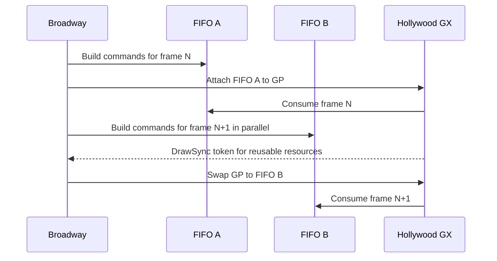

# Wii Rendering Techniques and Engine Optimisation for Maximum Performance

## Executive summary

The Wii is not a small modern GPU with programmable shaders; it is a very fast, very quirky fixed-function console whose practical ceiling is set by four things more than anything else: Broadway’s limited CPU-side submission bandwidth, Hollywood’s Flipper-like fixed pipeline, the cost of EFB work and EFB copies, and cache-friendly data layout for vertex and texture fetch. Public Wii documentation and reverse-engineered GameCube/Wii references all point in the same direction: if you want maximum frame rate, you win by reducing overdraw, keeping TEV programs short, batching aggressively, feeding the GX FIFO in large coherent chunks, and using native tiled/CMPR-friendly texture layouts with mipmaps. The platform does support sophisticated effects, but every extra TEV stage, texture cache miss, display copy, pixel-format switch, or CPU/GPU synchronisation point costs real milliseconds. citeturn18view0turn32view0turn37view0turn8view4turn41view1

For most real engines, the fastest Wii renderer is an opaque-first, front-to-back, indexed-mesh renderer that keeps hot CPU structures in MEM1, pushes bulk/static assets to MEM2, uses CMPR or 16-bit textures wherever visible quality allows, minimises EFB-to-texture copies, sorts by expensive state, and overlaps CPU command generation with GPU consumption through the GX FIFO instead of stalling on `GX_DrawDone`. TEV should be treated as a scarce material budget, not as a free substitute for unlimited shaders: one to two stages for ordinary opaque materials, more only for hero assets or effects that genuinely avoid an entire extra pass. citeturn17view0turn39view2turn39view3turn9view3turn11view0turn22view1

If you did not specify a target, the most useful default optimisation target is **stable 60 Hz at 480p-class output on retail hardware**, with a fallback of 30 Hz for scenes requiring more TEV, more alpha, or more EFB effects. Under that target, the biggest wins usually come from culling and draw-call reduction on the CPU, overdraw control and early-Z on the GPU, and texture-format discipline in content. citeturn32view0turn9view0turn41view1turn42view2

| Priority | What to do first | Why it usually wins on Wii | Basis |
|---|---|---|---|
| Highest | Make opaque rendering front-to-back and keep Z compare before texturing wherever possible | Hidden pixels are rejected before texturing in the fast path, which directly saves TEV and texture work | `GX_SetZCompLoc` documentation and pipeline patents. citeturn9view0turn37view0 |
| Highest | Batch by material/state and cache static geometry in display lists | Broadway submission is precious; display lists use a separate prefetched FIFO and reduce repeated command traffic | `GX_CallDispList`, GX FIFO docs. citeturn30view0turn30view1turn18view0 |
| Highest | Use indexed vertex arrays for reusable meshes, aligned to 32 bytes | Indexed attributes use the GP vertex cache; direct attributes bypass it | `GX_SetArray`, `GX_InvVtxCache`. citeturn40view0turn11view0 |
| High | Prefer CMPR or 16-bit formats over RGBA8 unless quality demands otherwise | Native block compression and smaller texels improve bandwidth and cache residency; `RGBA8` is notably heavier | Texture-format docs and RGBA8 filter note. citeturn22view0turn12view1turn22view1 |
| High | Avoid unnecessary EFB copies and pixel-format switches | EFB copies are real work; `GX_SetPixelFmt` explicitly stalls the pipeline | Patent copy-path docs and `GX_SetPixelFmt`. citeturn37view1turn41view1 |
| Medium | Use multi-buffered FIFO submission and sync tokens instead of full draw stalls | Better CPU/GPU overlap, fewer frame-ending bubbles | `GX_SetCPUFifo`, `GX_SetGPFifo`, `GX_SetDrawSync`. citeturn39view2turn39view3turn9view7 |

## Assumptions and tuning targets

Because you did not specify frame rate, resolution, visual-quality floor, or whether you are using public homebrew tooling or Nintendo’s licensed SDK, this report assumes three practical scenarios: **homebrew/libogc on retail hardware**, **licensed GX development on the same hardware**, and **content targeted either at 60 Hz gameplay or 30 Hz with heavier materials/effects**. The hardware rules are the same in all cases; what changes is mainly tooling, legal access to manuals, and how much low-level profiling support you have. Nintendo’s public developer process says platform SDK access requires signing an NDA, so public reverse-engineered references and libogc documentation are the usable base for homebrew, while licensed teams can map the same concepts onto official manuals and converters. citeturn8view3turn27search3turn18view0

A sensible tuning split is:

| Target | Recommended frame budget strategy | Typical visual compromises |
|---|---|---|
| 480p / 60 Hz | Opaque-first, minimal overdraw, mostly one-pass materials, CMPR/16-bit textures, sparse EFB effects | Less RTT/post-process, fewer translucent layers, stricter LOD and culling |
| 480p / 30 Hz | More TEV-heavy hero materials, selected RTT and copy effects, some multi-pass where justified | Higher overdraw tolerance, more alpha and compositing |
| Homebrew/libogc | Prefer what is easy to profile and validate on hardware: GX metrics, FIFO discipline, simple allocator control | Avoid undocumented register hacking unless you can prove a win on hardware |
| Licensed SDK | Same rendering advice, but with better offline tools and proprietary docs under NDA | Proprietary manuals are not publicly redistributable |

The first two rows are engineering targets inferred from the platform’s documented CPU bandwidth, texture/pixel behaviour, EFB copy path, and TEV model rather than from any single Nintendo benchmark. citeturn32view0turn37view1turn41view1turn9view3

## Hardware constraints and rendering path

The Wii’s main CPU is **Broadway**, an IBM PowerPC-derived part clocked up to 729 MHz with 32 KB instruction and 32 KB data L1 caches, an on-chip 256 KB L2, paired-single floating-point support, a write-gather buffer for graphics command submission, and a 16 KB locked-cache/scratch-pad mode backed by a DMA engine with a 15-entry queue. The same public references note a 243 MHz, 64-bit bus to main memory with about 1.9 GB/s peak CPU bandwidth. Those numbers immediately explain why CPU-side scene management, submission overhead, and memory locality matter so much on Wii: the machine is capable, but it is not forgiving of pointer-heavy engines or tiny draw calls. citeturn32view0turn25search6turn34view4turn34view2turn36view1turn35view0

Hollywood’s GX is best understood as a higher-clocked, Wii-era continuation of the GameCube’s Flipper-style design. WiiBrew states that the GX capabilities are similar to Flipper but run faster on Wii; public ArtX/Nintendo patents describe the graphics path as a **command processor**, **transform unit**, **setup/rasterizer**, **texture unit with on-chip TMEM**, **texture environment unit**, and **pixel engine** writing to embedded framebuffer memory, with Z comparison sometimes movable earlier in the pipe depending on render mode. That is the mental model you want when optimising: not “vertex shader then pixel shader”, but “how much data do I force through XF, texture fetch, TEV, and PE, and how often do I flush or copy the EFB?” citeturn18view0turn37view0turn37view2

```mermaid
flowchart LR
    CPU[Broadway CPU] --> WG[Write-gather pipe]
    WG --> FIFO[GX FIFO in main memory]
    FIFO --> CP[Command Processor]
    CP --> XF[Transform and lighting]
    XF --> RAS[Setup and rasterizer]
    RAS --> TX[Texture unit and TMEM]
    TX --> TEV[TEV fixed-function combiner]
    TEV --> PE[Pixel engine and Z and blend]
    PE --> EFB[Embedded framebuffer]
    EFB --> BP[Blitting and copy path]
    BP --> XFB[External framebuffer in main memory]
    XFB --> VI[Video Interface]
    MEM[MEM1 and MEM2 textures and vertex arrays] --> CP
    MEM --> TX
```



The public GX API documented by libogc exposes the same architectural boundaries very clearly. There are **8 texture-coordinate outputs** available to the material system and **16 TEV stages**; the last active stage must write to `GX_TEVPREV`, and if Z-texturing is enabled it occupies the last stage. Public patent text also describes the transform path supporting **up to eight per-vertex lights** and texture-coordinate generation in hardware. In practice, that means Wii materials are about budgeting TEV stages, texture fetches, and coordinate generators so you can keep work in a single pass without turning every surface into a worst-case path. citeturn11view4turn9view3turn37view0

The EFB/XFB split matters more on Wii than on many later consoles. The pixel engine writes to the embedded framebuffer; the copy path then resolves/copies EFB contents to main memory for the video interface, or to a texture in main memory for dynamic effects. WiiBrew’s blitting-processor page says this EFB→XFB path also performs **RGBA→YCbCr conversion** plus scaling and anti-aliasing/filtering, while the patents describe the same copy path as the route used both for display and for render-to-texture style effects. This is powerful, but it also means EFB copies are part of the frame budget, not “free presentation”. citeturn8view4turn37view1

`GX_SetPixelFmt` is one of the most load-bearing pieces of documentation for performance planning. libogc states that the non-AA EFB formats are `GX_PF_RGB8_Z24` and `GX_PF_RGBA6_Z24`, with a fixed EFB stride of 640 pixels and 528 available lines. In AA mode, `GX_PF_RGB565_Z16` enables multisampling; the docs say three 16-bit colour/Z samples are computed per pixel and the available EFB size drops to **640 × 264**. The same function warns that changing pixel format synchronises the pixel pipeline and causes a GPU stall. In other words: AA is not a checkbox you turn on casually, and pixel-format bucketing is worth real engine effort. citeturn41view0turn41view1turn41view2turn41view3

Early-Z is not an abstract concept here; it is literally a mode decision you control. `GX_SetZCompLoc` says Z buffering can happen before or after texturing, and that it should normally happen **before** texturing for better performance, because hidden pixels then avoid texture work entirely. When alpha compare is involved, Z must happen **after** texturing so cutout results are correct. That makes the correct render-queue structure quite strict: opaque front-to-back first with Z-before-texture, then alpha-tested cutouts, then true translucency last. citeturn9view0turn40view0

## Memory and bandwidth behaviour

The retail Wii exposes **24 MB of MEM1** and **64 MB of MEM2**. WiiBrew identifies MEM1 as internal 1T-SRAM and MEM2 as external GDDR3 SDRAM; the same memory-map page notes that IOS usually reserves the top **12 MB** of MEM2, leaving the rest shared with Broadway. Hollywood’s memory interface exposes separate bandwidth-dial and request-counter registers for the command processor, texture control, pixel engine, CPU reads, and CPU writes, which is a strong public hint that rendering performance on Wii is fundamentally a shared-memory arbitration problem, not just a “GPU-only” one. citeturn16view0turn17view0turn17view1

The practical memory rule is therefore simple: **put latency-sensitive CPU data, hot dynamic render data, and frequently touched command/data structures in MEM1; put bulk textures, large static meshes, and infrequently updated assets in MEM2 when capacity pressure demands it**. That placement rule is an engineering recommendation rather than a vendor-prescribed law, but it follows directly from the documented split between a small low-latency memory and a larger external pool plus shared arbitration between CPU, CP, texture control, and the pixel engine. citeturn16view0turn17view0turn17view1

The CPU side is also unusually explicit about cache management. Broadway’s public docs describe 32-byte cache lines, a 16 KB locked-cache mode, paired-single SIMD-style arithmetic, and DMA between locked cache and external memory; libogc mirrors the same granularity by repeatedly requiring **32-byte alignment** for FIFOs, display lists, texture buffers, and performance-friendly attribute arrays. That is not accidental. On this machine, 32-byte alignment is not a micro-optimisation afterthought; it is the unit around which the caches, write-gather pipe, vertex fetch path, and many copy operations are designed. citeturn25search6turn34view4turn34view2turn36view1turn8view2

The texture side is similarly shaped by native tiling and TMEM behaviour. libogc exposes native formats including `I4`, `I8`, `IA4`, `IA8`, `RGB565`, `RGB5A3`, `RGBA8`, `CI4`, `CI8`, `CI14`, and `CMPR`. YAGCD explains that native textures are stored as 32-byte tiles, and that CMPR is divided into 32-byte tiles containing four DXT1-like subblocks. Community documentation also reports that RGBA8 is a special tiled case, and libogc explicitly notes that trilinear minification on `GX_TF_RGBA8` takes roughly **twice as much** as other formats in an ideal cache-hit scenario. Put bluntly: if you fill MEM2 with big RGBA8 textures and trilinear them everywhere, you are choosing the slow lane. citeturn22view0turn12view1turn12view2turn22view1turn23search1

| Memory or surface | Publicly documented behaviour | Fast-path guidance | Basis |
|---|---|---|---|
| MEM1 | 24 MB internal 1T-SRAM | Keep render queues, dynamic buffers, visibility data, small hot textures here | Wii hardware summary and memory map. citeturn16view0turn17view0 |
| MEM2 | 64 MB external GDDR3; top 12 MB often reserved by IOS | Use as bulk asset pool when MEM1 is too small; avoid putting constantly-updated hot data here if you can help it | Wii memory map. citeturn17view0 |
| EFB | Embedded framebuffer memory, on-chip; copied out for display and RTT | Treat EFB work and copies as budgeted GPU work; minimise needless resolves/copies | YAGCD glossary, patents, WiiBrew blit page. citeturn19search0turn37view1turn8view4 |
| XFB | External framebuffer in main memory, consumed by VI | Double-buffer normally; do not think of it as a modern render target | YAGCD glossary, WiiBrew blit page. citeturn19search0turn8view4 |
| TMEM cache regions | 32K, 128K, or 512K cache-region sizes | Preload only tiny, very hot textures; do not thrash TMEM with careless atlas churn | `GX_InitTexCacheRegion`, `GX_InitTexPreloadRegion`. citeturn31view0turn31view1turn31view4 |

For texture caches, libogc gives unusually useful timing hints. Invalidating all texture caches takes about **512 GP clocks**; invalidating a **32 KB** region takes **16 GP clocks**; preloaded textures bypass tag lookup and read directly from TMEM; and a preloaded region tops out at **512 KB**. Those details strongly suggest two practical rules. First, only preload tiny, repeatedly reused textures that are truly hot across many draws. Second, if you stream or update textures dynamically, invalidate the smallest region possible instead of nuking everything indiscriminately. citeturn11view5turn31view1turn31view3

Vertex fetch has a similarly explicit contract. `GX_SetArray` says indexed data is loaded into a **vertex cache** and fetched in **32-byte** chunks; it recommends 32-byte alignment and even arranging data so elements do not span 32-byte boundaries. `GX_InvVtxCache` says indexed attributes use the vertex cache but direct data bypasses it entirely, and that invalidating the cache tags takes just **two GP clocks**. That makes the preferred strategy very clear: use **indexed arrays** for reusable meshes, reserve **direct/immediate vertices** for tiny dynamic primitives or debug/UI cases, and invalidate vertex cache only when you actually mutate or relocate indexed arrays. citeturn40view0turn11view0

Texture-format choice deserves its own quick decision table:

| Texture use | Recommended default | Why | Trade-off |
|---|---|---|---|
| Large diffuse/environment maps | `CMPR` | Best bandwidth and cache density; DXT1-class block compression fits the hardware well | Artefacts, especially on gradients and normal-like data |
| Opaque lightmaps/detail maps | `RGB565` | Compact, native, good enough precision for many baked buffers | No alpha, less colour precision than RGBA8 |
| UI or cutout textures with modest alpha needs | `RGB5A3` | Native 16-bit storage; good compromise for many sprites | Alpha precision is limited |
| Data that truly needs 8-bit alpha or strong colour fidelity | `RGBA8` | Full 32-bit path | Heaviest common format; notably worse with trilinear filtering |
| Paletted assets | `CI4`/`CI8`/`CI14` | Good when content is palette-friendly | TLUT management overhead and awkward art pipeline |

The format names and `RGBA8` performance warning are documented; the “recommended default” column is an engineering choice inferred from those facts and from the Wii’s documented bandwidth/cache behaviour. citeturn22view0turn22view1turn31view3turn32view0

## Engine-level optimisation strategies

The fastest Wii engines are built around **visibility reduction first**, because every primitive you do not submit saves Broadway submission work, vertex fetch, TEV work, and EFB bandwidth simultaneously. Broad-phase frustum culling is mandatory; then, depending on the game, add sector/portal visibility, cell-based PVS, or lightweight software occluders. Public GX does expose `GX_ClearBoundingBox` and `GX_ReadBoundingBox`, which can tell you the EFB-space bounds of rendered pixels, but this is better thought of as a specialised visibility aid than a modern asynchronous occlusion-query system. Because it works in 2×2 quads and readback is CPU-visible, it is useful for a few coarse tests, not for per-object fine-grained culling at scale. citeturn9view1turn40view0turn43view2

For LOD, the most important distinction on Wii is not just triangle count but **material cost and screen overdraw**. A lower-LOD model that still uses the same heavy alpha or multi-stage TEV material often wins much less than expected. Good Wii LOD policy therefore usually changes both **geometry and material complexity**: fewer vertices, fewer TEV stages, smaller texture sets, and less alpha. That recommendation is an inference, but it follows directly from the architecture’s fixed-function stage budgeting and early-Z behaviour. citeturn9view0turn9view3turn37view0

Batching should be organised around the most expensive state changes first. The strongest evidence in the public docs is that `GX_SetPixelFmt` stalls the GPU, `GX_CopyTex` often requires `GX_PixModeSync` before reuse, texture invalidation and preloading have explicit costs, and the platform is sensitive to CPU-side command traffic. So sort opaque draws primarily by **pixel format**, **Z/alpha mode**, **blend mode**, **TEV program**, and **texture bindings**, then by mesh. Try hard to keep a frame’s dominant opaque path in one stable state bucket. citeturn41view1turn42view2turn42view3turn31view3turn39view2

Display lists are one of the underused “Wii-native” optimisations. `GX_BeginDispList`/`GX_EndDispList` let you compile static command streams into 32-byte-aligned buffers, and `GX_CallDispList` says the GP executes them through a separate **4 KB prefetch FIFO**, preventing prefetched data for the main stream from being lost. For static props, static sky geometry, repeated decal batches, or shared material state blocks, this is often a better bargain than re-emitting the same commands every frame. The catches are real but manageable: no nesting, pad to 32 bytes, leave safety slack in the buffer, and remember the write-gather pipe mechanics. citeturn30view0turn30view1turn30view2

TEV planning is where a lot of “Wii look” comes from, but also where slow renderers are born. The TEV is excellent at combining base texture, vertex colour/light, simple lightmaps, detail maps, projected textures, embossing-style tricks, and some fog/depth blends **inside one pass**. The hardware patents explicitly describe multi-stage environment processing and indirect texturing, and libogc exposes 16 stages. That means you should usually prefer a careful single-pass TEV program over a second full pass. The exception is when the additional stage count, texture fetches, or alpha interactions destroy the common-case fast path. Hero materials can spend more; background materials should be brutally simple. citeturn37view0turn37view2turn9view3turn10search13

A useful way to think about TEV budgets on Wii is:

| Material class | Recommended TEV budget | When to allow more | Basis |
|---|---|---|---|
| Default opaque world/materials | 1–2 stages | Rarely | 16-stage total budget exists, but early-Z and cache-friendly one-pass rendering are the fast path. citeturn9view3turn9view0turn37view0 |
| Hero opaque surfaces | 3–4 stages | If it avoids a second pass | Patent TEV capabilities and single-pass bias. citeturn37view0turn37view2 |
| Alpha-tested foliage/cutouts | 1–2 stages | Only if absolutely necessary | Z must move after texturing for correct alpha compare; this is a slower class. citeturn9view0turn40view0 |
| True translucency | Keep minimal | Almost never | Back-to-front blending defeats early-Z and amplifies overdraw. citeturn9view0turn41view2 |
| RTT/post-process passes | 1 stage if possible | Only high-value effects | Copy path and synchronisation cost. citeturn37view1turn42view2turn42view3 |

The impact levels below are **engineering estimates**, not vendor-published benchmarks. They are derived from the documented behaviour of the GX FIFO, EFB copy path, TEV stage limits, texture/vertex cache rules, and pixel-format stalls.

| Technique | When it tends to pay off | Typical impact estimate | Main hazard |
|---|---|---|---|
| Opaque front-to-back sorting | TEV-heavy scenes with overdraw | High GPU-side gain, often the single biggest fill reduction | CPU sorting cost if overdone |
| Material/state sorting | Many small draws, many materials | High CPU gain, moderate GPU gain | Can hurt front-to-back unless you use coarse buckets |
| Indexed vertex arrays | Reused mesh data | Moderate to high | Dynamic mutation requires cache invalidation discipline |
| Display lists for static content | Repeated static props or state blocks | Moderate CPU gain | Buffer management and no nesting |
| CMPR + mipmaps | Large texture working set | High bandwidth/cache win | Compression artefacts |
| TMEM preloading | Tiny, constantly reused hot textures | Small to moderate, but extremely scene-specific | Easy to waste TMEM and hurt everything else |
| Z-prepass | Pixel-bound scenes with expensive TEV and heavy overdraw | Scene-dependent; moderate only when fill-bound | Extra CPU submission and geometry cost |
| EFB render-to-texture | Mirrors, heat haze, projected buffers, post passes | Value can be high, but cost is always real | Copy and sync overhead |
| Bounding-box-based visibility aids | A few coarse occlusion tests | Small to moderate in specialised cases | Readback/coherency complexity |
| FIFO multi-buffering | CPU and GPU both busy every frame | Moderate CPU/GPU overlap gain | More complicated frame orchestration |

A full-frame Z-prepass is not automatically a win on Wii. Because Broadway submission is valuable and the GPU already supports Z-before-texturing in the common opaque path, a prepass usually helps only when your opaque pass is clearly **fill-bound** by expensive TEV and overdraw. If your bottleneck is CPU-side submission, state churn, or texture/cache behaviour, Z-prepass can make the frame slower. Use it surgically: large occluding architecture and especially costly materials, not everything. citeturn9view0turn39view2turn37view0

CPU/GPU overlap is another major differentiator between average and fast Wii renderers. libogc explicitly supports both **immediate mode** and a **multi-buffered mode** where the CPU can fill one FIFO while the GP consumes another; it also documents watermarks that suspend and resume the GX thread when the FIFO gets too full. This is exactly what you want for a frame pipeline: build command buffers for frame *n+1* while the GPU eats frame *n*, and use **draw-sync tokens** to retire shared resources instead of global end-of-frame stalls. `GX_DrawDone` and especially `GX_WaitDrawDone` are correctness tools, not something you want on the hot path every frame. citeturn39view1turn39view2turn39view3turn39view4turn9view7



For occlusion, the important answer is nuanced. In the public GX stack reviewed here, I found **bounding-box tracking** and EFB read/peek functionality, but not a modern D3D/OpenGL-style asynchronous occlusion-query object. So the practical approach on Wii is usually one of three things: software occlusion/portal systems on the CPU; coarse hardware-assisted tests using bounding boxes only for a few high-value cases; or simply relying on front-to-back ordering plus strong broad-phase culling. citeturn9view1turn43view2turn43view3

## Practical code patterns

The snippets below use **libogc/GX**, because that is the public API surface with the best available documentation. The same ideas map closely to licensed GX code because the architecture and function model are the same, even if official samples and manuals are NDA-restricted. citeturn27search3turn8view3

The first pattern is the “boring but fast” initialisation path: aligned FIFO, one dominant non-AA pixel format, standard EFB→XFB setup, and copy-clear so the display copy also clears the EFB. devkitPro’s GX examples use exactly this style of set-up, including aligned FIFO allocation, `GX_SetCopyClear`, `GX_SetDispCopySrc/Dst`, `GX_SetCopyFilter`, and `GX_CopyDisp`. Avoid switching the pixel format again during the frame unless a specific pass absolutely requires it. citeturn28search0turn28search3turn41view1

```cpp
#include <gccore.h>
#include <malloc.h>
#include <string.h>

static constexpr u32 kFifoSize = 256 * 1024;
static void* s_fifo = nullptr;
static GXRModeObj* s_rmode = nullptr;
static void* s_xfb[2] = {nullptr, nullptr};
static int s_fb = 0;

bool InitVideoAndGX()
{
    VIDEO_Init();
    s_rmode = VIDEO_GetPreferredMode(nullptr);
    if (!s_rmode) return false;

    s_xfb[0] = MEM_K0_TO_K1(SYS_AllocateFramebuffer(s_rmode));
    s_xfb[1] = MEM_K0_TO_K1(SYS_AllocateFramebuffer(s_rmode));
    if (!s_xfb[0] || !s_xfb[1]) return false;

    VIDEO_Configure(s_rmode);
    VIDEO_SetNextFramebuffer(s_xfb[s_fb]);
    VIDEO_SetBlack(false);
    VIDEO_Flush();
    VIDEO_WaitVSync();
    if (s_rmode->viTVMode & VI_NON_INTERLACE)
        VIDEO_WaitVSync();

    s_fifo = memalign(32, kFifoSize);
    if (!s_fifo) return false;
    memset(s_fifo, 0, kFifoSize);
    GX_Init(s_fifo, kFifoSize);

    GXColor clear = {0, 0, 0, 0xff};
    GX_SetCopyClear(clear, 0x00ffffff);

    GX_SetViewport(0.0f, 0.0f, s_rmode->fbWidth, s_rmode->efbHeight, 0.0f, 1.0f);
    GX_SetScissor(0, 0, s_rmode->fbWidth, s_rmode->efbHeight);

    const f32 yscale = GX_GetYScaleFactor(s_rmode->efbHeight, s_rmode->xfbHeight);
    const u16 xfbHeight = GX_SetDispCopyYScale(yscale);

    GX_SetDispCopySrc(0, 0, s_rmode->fbWidth, s_rmode->efbHeight);
    GX_SetDispCopyDst(s_rmode->fbWidth, xfbHeight);
    GX_SetCopyFilter(s_rmode->aa, s_rmode->sample_pattern, GX_TRUE, s_rmode->vfilter);
    GX_SetFieldMode(s_rmode->field_rendering,
                    ((s_rmode->viHeight == 2 * s_rmode->xfbHeight) ? GX_ENABLE : GX_DISABLE));

    // Fast default: no AA, 24-bit Z.
    GX_SetPixelFmt(GX_PF_RGB8_Z24, GX_ZC_LINEAR);
    GX_SetCullMode(GX_CULL_BACK);
    GX_SetZMode(GX_TRUE, GX_LEQUAL, GX_TRUE);
    GX_SetZCompLoc(GX_TRUE);           // early Z for opaque fast path
    GX_SetColorUpdate(GX_TRUE);
    GX_SetAlphaUpdate(GX_FALSE);

    // Resolve + clear EFB once.
    GX_CopyDisp(s_xfb[s_fb], GX_TRUE);
    GX_SetDispCopyGamma(GX_GM_1_0);
    return true;
}
```

For mesh submission, the public docs are very explicit: indexed attributes use the GP vertex cache, direct data does not, and 32-byte alignment helps because the cache fetches 32-byte chunks. That leads to a clean rule of thumb: use direct vertices only for tiny dynamic batches; use indexed arrays for everything else. When you update a dynamic indexed mesh, flush the CPU cache for the changed range and invalidate the vertex cache tags once. citeturn40view0turn11view0

```cpp
struct ATTRIBUTE_ALIGN(32) PackedPos { s16 x, y, z; };
struct ATTRIBUTE_ALIGN(32) PackedNrm { s8 x, y, z, pad; };
struct ATTRIBUTE_ALIGN(32) PackedUV  { s16 s, t; };

static PackedPos* g_positions = nullptr;
static PackedNrm* g_normals   = nullptr;
static PackedUV*  g_uvs       = nullptr;

void SetupIndexedMeshStreams()
{
    GX_ClearVtxDesc();

    GX_SetVtxDesc(GX_VA_POS,  GX_INDEX16);
    GX_SetVtxDesc(GX_VA_NRM,  GX_INDEX16);
    GX_SetVtxDesc(GX_VA_TEX0, GX_INDEX16);

    GX_SetVtxAttrFmt(GX_VTXFMT0, GX_VA_POS,  GX_POS_XYZ, GX_S16, 8); // fixed-point
    GX_SetVtxAttrFmt(GX_VTXFMT0, GX_VA_NRM,  GX_NRM_XYZ, GX_S8,  6);
    GX_SetVtxAttrFmt(GX_VTXFMT0, GX_VA_TEX0, GX_TEX_ST,  GX_S16, 10);

    GX_SetArray(GX_VA_POS,  g_positions, sizeof(PackedPos));
    GX_SetArray(GX_VA_NRM,  g_normals,   sizeof(PackedNrm));
    GX_SetArray(GX_VA_TEX0, g_uvs,       sizeof(PackedUV));
}

void UpdateDynamicMeshRange(void* ptr, size_t bytes)
{
    DCFlushRange(ptr, bytes);  // push CPU writes to memory
    GX_InvVtxCache();          // fast GP-side tag invalidate
}
```

Material setup should explicitly separate **opaque**, **alpha-tested cutout**, and **true translucent** paths. The opaque path wants Z-before-texture. Tree billboards and other cutouts want alpha compare with Z-after-texture so rejected texels do not write depth incorrectly. True translucency then comes last with depth writes usually disabled. This is not stylistic preference; it is the behaviour documented by `GX_SetZCompLoc` and `GX_SetAlphaCompare`. citeturn9view0turn40view0

```cpp
void SetOpaqueModulateTex()
{
    GX_SetNumTexGens(1);
    GX_SetNumTevStages(1);
    GX_SetTevOrder(GX_TEVSTAGE0, GX_TEXCOORD0, GX_TEXMAP0, GX_COLOR0A0);
    GX_SetTevOp(GX_TEVSTAGE0, GX_MODULATE);

    GX_SetBlendMode(GX_BM_NONE, GX_BL_ONE, GX_BL_ZERO, GX_LO_SET);
    GX_SetAlphaCompare(GX_ALWAYS, 0, GX_AOP_AND, GX_ALWAYS, 0);
    GX_SetZMode(GX_TRUE, GX_LEQUAL, GX_TRUE);
    GX_SetZCompLoc(GX_TRUE);   // reject hidden pixels before texturing
}

void SetCutoutAlphaTest(u8 threshold)
{
    GX_SetNumTexGens(1);
    GX_SetNumTevStages(1);
    GX_SetTevOrder(GX_TEVSTAGE0, GX_TEXCOORD0, GX_TEXMAP0, GX_COLOR0A0);
    GX_SetTevOp(GX_TEVSTAGE0, GX_MODULATE);

    GX_SetAlphaCompare(GX_GEQUAL, threshold, GX_AOP_AND, GX_ALWAYS, 0);
    GX_SetBlendMode(GX_BM_NONE, GX_BL_ONE, GX_BL_ZERO, GX_LO_SET);

    // Required for correct depth with cutout textures.
    GX_SetZMode(GX_TRUE, GX_LEQUAL, GX_TRUE);
    GX_SetZCompLoc(GX_FALSE);  // compare/write after texturing and alpha test
}

void SetTranslucent()
{
    GX_SetAlphaCompare(GX_ALWAYS, 0, GX_AOP_AND, GX_ALWAYS, 0);
    GX_SetBlendMode(GX_BM_BLEND, GX_BL_SRCALPHA, GX_BL_INVSRCALPHA, GX_LO_SET);
    GX_SetZMode(GX_TRUE, GX_LEQUAL, GX_FALSE); // read depth, do not write
    GX_SetZCompLoc(GX_FALSE);
}
```

Static display lists are one of the best CPU-side wins for prop-heavy scenes. The public docs require a 32-byte-aligned buffer, advise leaving extra slack because of write-gather flushing, and explain that execution uses a separate prefetch FIFO. A good engine pattern is therefore to compile one display list per static mesh/material variant at load time, then call it from a lightweight draw packet at runtime. citeturn30view0turn30view1turn30view2

```cpp
struct StaticDL
{
    void*  buffer = nullptr;
    u32    size   = 0;
};

bool BuildStaticDisplayList(StaticDL& out, size_t maxBytes)
{
    out.buffer = memalign(32, maxBytes + 64); // leave slack for WG flush/padding
    if (!out.buffer) return false;

    memset(out.buffer, 0, maxBytes + 64);
    DCInvalidateRange(out.buffer, maxBytes + 64);

    GX_BeginDispList(out.buffer, static_cast<u32>(maxBytes + 64));

    // Emit static state + geometry here.
    GX_Begin(GX_TRIANGLES, GX_VTXFMT0, 3);
    // ... indices or direct vertices ...
    GX_End();

    out.size = GX_EndDispList();
    return out.size != 0;
}

void DrawStaticDisplayList(const StaticDL& dl)
{
    GX_CallDispList(dl.buffer, dl.size);
}
```

Render-to-texture on Wii is really “copy EFB into a tiled texture in main memory”. The key details are all documented: the source rectangle must be aligned to 2 pixels/lines, the destination buffer must be 32-byte aligned, widths and heights are padded to tile boundaries in the native format, and if you sample the result immediately you often need `GX_PixModeSync` to flush the pipe first. This makes EFB effects practical, but only if you keep them sparse and small. citeturn42view0turn42view1turn42view2turn42view3

```cpp
bool CopyEfbRegionToTexture(void* dst, u16 w, u16 h, GXTexObj* outTex)
{
    if (!dst || !outTex) return false;

    const u32 bytes = GX_GetTexBufferSize(w, h, GX_TF_RGB565, GX_FALSE, 0);
    if ((reinterpret_cast<uintptr_t>(dst) & 31u) != 0) return false;

    // Configure copy path.
    GX_SetTexCopySrc(0, 0, w, h);
    GX_SetTexCopyDst(w, h, GX_TF_RGB565, GX_FALSE);
    GX_CopyTex(dst, GX_FALSE);

    // If sampled immediately afterwards, flush pixel pipe state.
    GX_PixModeSync();

    GX_InitTexObj(outTex, dst, w, h, GX_TF_RGB565, GX_CLAMP, GX_CLAMP, GX_FALSE);
    GX_InitTexObjFilterMode(outTex, GX_LINEAR, GX_LINEAR);
    return true;
}
```

One more micro-pattern is worth calling out even without another code block: **prefer `GX_SetDrawSync` tokens over `GX_DrawDone` for resource retirement**. `GX_SetDrawSync` sends a token into the command stream and can notify the CPU when that point is reached, which is exactly what you want when double-buffering dynamic vertex data, texture staging buffers, or display-list scratch. `GX_DrawDone` stalls until the pipe drains; use it when correctness absolutely requires a full fence, not as a routine frame marker. citeturn9view7turn39view2

## Source links and legal notes

The sources below are the public references I would keep beside me when implementing or profiling a Wii renderer. I have prioritised public primary sources, patents, public API docs, emulator/hardware tests, and established community reverse-engineering references. For **official Nintendo SDK manuals**, the public Nintendo developer process says you must accept an NDA to access platform SDK materials, so I have **not** linked unofficial mirrors of proprietary SDK manuals. Consumer-facing Wii manuals are public, but they are not graphics-programming references. citeturn8view3turn6search13

| Type | URL | Licence or usage note |
|---|---|---|
| Public GX API reference | `https://libogc.devkitpro.org/gx_8h.html` | Public libogc documentation for homebrew GX. This is the most useful public API reference reviewed here. citeturn8view2 |
| libogc repository | `https://github.com/devkitPro/libogc` | Public source repository. **Important legal note:** public allegations in 2025 claimed unattributed/stolen code in libogc; review provenance before relying on it for sensitive legal/compliance use. citeturn27search3turn7search12turn27news39 |
| devkitPro Wii examples | `https://github.com/devkitPro/wii-examples` | Public example set; the devkitPro org listing shows `wii-examples` under GPL-2.0. Useful for canonical init/copy/filter patterns. citeturn44search2turn44search6 |
| Example GX lesson source | `https://github.com/devkitPro/wii-examples/blob/master/graphics/gx/neheGX/lesson04/source/lesson4.c` | Public sample source showing standard video/GX setup and display-copy path. citeturn28search0 |
| Example GX sprite source | `https://github.com/devkitPro/wii-examples/blob/master/graphics/gx/gxSprites/source/gxsprites.c` | Public sample source showing texture setup, TEV basics, and frame presentation. citeturn28search3 |
| WiiBrew hardware overview | `https://wiibrew.org/wiki/Hardware` | Public reverse-engineered Wii hardware reference. Unofficial but widely used. citeturn16view0 |
| WiiBrew Broadway | `https://wiibrew.org/wiki/Hardware/Broadway` | Public reverse-engineered CPU reference for Broadway caches, paired single, DMA, write-gather. citeturn32view0 |
| WiiBrew main memory | `https://wiibrew.org/wiki/Hardware/Main_Memory` | Public reverse-engineered MEM1/MEM2 map and IOS reservation note. citeturn17view0 |
| WiiBrew GX/blitting processor | `https://wiibrew.org/wiki/Hardware/GX/Blitting_Processor` | Public note on EFB→XFB copy, YCbCr conversion, scaling, AA path. citeturn8view4 |
| YAGCD index | `https://www.gc-forever.com/yagcd/` | Public community reverse-engineering reference for GameCube/Wii-family hardware concepts. Unofficial. citeturn8view0 |
| YAGCD texture formats | `https://hitmen.c02.at/files/yagcd/yagcd/chap17.html` | Public reverse-engineered texture/tile/CMPR reference. Unofficial community source. citeturn8view1 |
| IBM 750CL manual | `https://fail0verflow.com/media/files/ppc_750cl.pdf` | Public mirror of IBM’s CPU manual; useful for paired singles, locked cache, DMA, cache-line facts. Mirror location is third-party, document is IBM-authored. citeturn33view0turn35view0turn35view2turn36view1 |
| Google patent on graphics system interface | `https://patents.google.com/patent/US7071945B2/en` | Public patent; primary source for pipeline blocks, early-Z possibility, and EFB copy path. citeturn37view0turn37view1 |
| Google patent on pipeline token sync | `https://patents.google.com/patent/US6867781B1/en` | Public patent; corroborates TEV, PE, embedded framebuffer, and copy behaviour. citeturn37view2 |
| Dolphin repository | `https://github.com/dolphin-emu/dolphin` | Public emulator source; GitHub and Dolphin FAQ identify it as GPL-2.0-or-later. Excellent for understanding texture decode, EFB/XFB behaviour, and edge cases. citeturn44search9turn44search17 |
| Dolphin texture decoder header | `https://github.com/dolphin-emu/dolphin/blob/master/Source/Core/VideoCommon/TextureDecoder.h` | Public source entry point for native texture handling. GPL-2.0-or-later as part of Dolphin. citeturn15search4turn44search9 |
| Dolphin hardware tests | `https://github.com/dolphin-emu/hwtests` | Public GameCube/Wii hardware test suite; GitHub labels it GPL-2.0 and the README says GPLv2. Excellent for validating hardware assumptions. citeturn44search1turn13search19 |
| GRRLIB | `https://github.com/GRRLIB/GRRLIB` | Public Wii graphics wrapper around GX. GRRLIB docs say MIT. Useful for higher-level 2D/3D convenience and examples. citeturn27search0turn44search11 |
| Wire3D | `https://github.com/rrath/Wire3D/` | Public 3D engine supporting Wii homebrew and PC; GitHub shows LGPL-3.0. Useful as an engine-level reference. citeturn27search1 |
| TEVSL | `https://github.com/crtc-demos/tevsl` | Public TEV “shader language” project for GameCube/Wii. Good for material-authoring ideas; verify repository licence before reuse, as it was not exposed clearly in the search snippets reviewed here. citeturn10search13 |
| Nintendo developer process | `https://developer.nintendo.com/the-process` | Official public statement that platform SDK access requires accepting Nintendo’s NDA and terms. Use this, not unofficial document dumps, if you need official tools legally. citeturn8view3 |
| Nintendo consumer manuals | `https://en-americas-support.nintendo.com/app/answers/detail/a_id/16881/~/downloadable-manuals` | Official public consumer manuals. Useful for hardware ownership, not for GX programming. citeturn6search13 |

For **official or archived Nintendo SDK material specifically about GX**, the public, legally clean route is still Nintendo’s developer portal. Unofficial mirrored “Revolution GX” and “architecture guide” PDFs do exist on the open web, but because those materials appear to be proprietary SDK documentation rather than publicly licensed manuals, I have not linked them here. If you are a licensed developer, obtain the genuine originals through Nintendo’s NDA-protected channel. If you are doing homebrew, the strongest public combination remains **libogc docs + WiiBrew + YAGCD + Dolphin source/hwtests + IBM CPU docs + public patents**. citeturn8view3turn8view2turn16view0turn8view0turn44search1turn37view0

In short, the Wii rewards engines that behave like disciplined late-fixed-function renderers: **CPU-coherent, front-to-back, batch-heavy, TEV-budgeted, native-format-aware, and suspicious of every synchronisation point**. If you optimise for that machine on its own terms, it still renders surprisingly fast. citeturn32view0turn39view2turn9view0turn22view1turn41view1